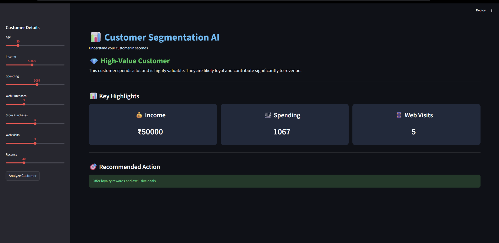

# 📊 Customer Segmentation AI

A simple and effective Machine Learning web app that classifies customers into meaningful segments based on their behavior and helps businesses take better decisions.

---

## 📸 Preview

---

## 🚀 Project Overview

This project uses **Machine Learning (K-Means Clustering)** to group customers based on their:

- Age  
- Income  
- Spending habits  
- Web & store purchases  
- Website visits  
- Recency (last interaction)

After prediction, the app provides:
- ✅ Customer segment  
- ✅ Easy explanation  
- ✅ Key highlights  
- ✅ Recommended business action  

---

## 🧠 Customer Segments

| Cluster | Segment |
|--------|--------|
| 0 | 💎 High-Value Customer |
| 1 | 👀 Window Shopper |
| 2 | 🧓 Low Engagement |
| 3 | ⚠️ Churn Risk |
| 4 | 📱 Digital Buyer |
| 5 | 🏬 Premium Offline Buyer |

---

## ⚙️ Tech Stack

- **Python**
- **Streamlit**
- **Scikit-learn**
- **Pandas & NumPy**
- **Plotly**

---

## 📂 Project Structure
customer-segmentation-ai/
│── app.py
│── customer_segmentation_model.pkl
│── scaler.pkl
│── requirements.txt
│── README.md
│── customer.png

